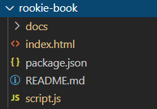

# rookie-book 介绍

> rookie-book 基于[Docute](https://docute.org/)和[ZEIT Now](https://zeit.co/home)搭建的适合作文档或是笔记的一个项目

### 项目结构

```bash
rookie-book
├──  docs
├──  index.html   ----- 启动页 
├──  script.js    ----- 顶部导航栏和侧边导航栏设置 
├──  README.md    ----- 项目介绍页
└─── package.json ----- 项目依赖
```
### 项目结构图示


### 项目启动页 index.html

```html
<!DOCTYPE>
<html>

<head>
    <meta charset="utf-8" />
    <meta name="viewport" content="width=device-width, initial-scale=1, shrink-to-fit=no" />
    <title>Rookie-book</title>
    <link rel="stylesheet" href="https://unpkg.com/docute@4/dist/docute.css" />
</head>

<body>
    <div id="docute"></div>
    <script src="https://unpkg.com/docute@4/dist/docute.js"></script>
    <script src="./script.js"></script>
</body>

</html>
```
### 项目顶部导航栏和侧边导航栏设置 script.js

```javascript
/* globals Docute */

new Docute({

  target: '#docute',
  sourcePath: './docs/',

  //顶部导航栏
  nav: [
    {
      title: '主页',
      link: '/'
    },
    {
      title: '工具',
      link: '/tool',
    }
  ],

  //侧边栏
  sidebar: [
    {
      title: 'Vue全家桶',

      links: [
        {
          title: 'Vue',
          link: '/前端/Vue全家桶/vue/vue',
        },
        {
          title: 'Vuex',
          link: '/前端/Vue全家桶/vuex/vuex',
        },
        {
          title: 'Vue-router',
          link: '/前端/Vue全家桶/vue-router/vue-router'
        },
        {
          title: 'Axios',
          link: '/前端/Vue全家桶/axios/axios'
        },
        {
          title: 'Element-ui',
          link: '/前端/Vue全家桶/elenemnt-ui/elenemnt-ui'
        }
      ]
    }
  ]
})
```
### 项目依赖 package.json

```javascript
{
    "private": true,
    "scripts": {
        "start": "serve ."
    },
    "devDependencies": {
        "serve": "^10.1.1"
    }
}
```